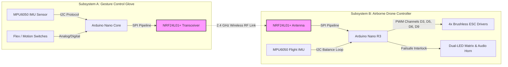

# VeloX-Rescue V1: End-to-End Gesture Controlled Rescue Drone System

An enterprise-grade, dual-subsystem IoT platform featuring a wireless **Gesture-Control Hand Glove (Transmitter)** and an **Airborne Drone Controller (Receiver)** with real-time dynamic balance, non-blocking telemetry, and acoustic-visual emergency failsafes—engineered for first responders in earthquakes and industrial building fire hazards.

---

### 🌐 System Architecture Navigation

| [🏠 Master System Repo](https://github.com/KhadijaDawood/VeloX-Rescue-V1-System-Glove-Transmitter-Airborne-Drone-Receiver-Framework-) | [🧤 Glove Transmitter Repo](https://github.com/KhadijaDawood/VeloX-Glove-Transmitter-V1) | [🛸 Drone Receiver Telemetry](https://github.com/KhadijaDawood/VeloX-Rescue-V1-Receiver-Telemetry) |
| :---: | :---: | :---: |

---

## 🏗️ System Architecture & Data Flow




## ⚙️ Integrated Hardware Framework

### 🖐️ Subsystem A: Gesture Control Glove (Transmitter)
* **Arduino Microcontroller Core:** Processes hand pitch, roll, and dynamic tilt vectors.
* **MPU6050 6-Axis IMU Sensor:** Captures real-time wrist orientation and dynamic gesture angles.
* **Flex / Motion Switches:** Controls throttle power levels through calibrated hand curvature.
* **NRF24L01+ Wireless Transceiver:** Encrypts and transmits gesture payloads over low-latency RF channels.
* **Autonomous Battery Pack:** Dedicated power subsystem for field mobility.

### 🚁 Subsystem B: Airborne Telemetry & Receiver (Drone)
* **Arduino Nano R3 Core:** Handles real-time flight telemetry, motor PWM calculations, and safety diagnostics.
* **NRF24L01+ Antenna Module:** Receives dynamic directional packets from the operator's glove.
* **MPU6050 Flight Stabilization IMU:** Monitors airborne frame attitude and dynamic balance.
* **Quad ESC PWM Interface (Pins D3, D5, D6, D9):** Maps gesture throttle outputs directly to brushless motors (1000us - 2000us).
* **Dual Status LED Matrix (Green / Red):** Visual feedback indicator for radio link integrity.
* **High-Decibel Piezo Acoustic Buzzer (1 kHz):** Triggers emergency auditory beacon upon signal loss.

---

## 🛠️ Complete Digital Prototype Assembly

[-2.jpg)](https://postimg.cc/py6x4cjc)
[](https://postimg.cc/CRsZH4fP)

## 🚀 Firmware Automation & Failsafe Logic

* **Dynamic Non-Blocking Loop:** Engine built entirely on `millis()` timing loops, eliminating `delay()` blocks to preserve microsecond motor update rates.
* **Automatic Radio Timeout Failsafe:** Dynamic tracking algorithm continuously monitors incoming RF packets. If no packet is received for 3000ms, the system engages an emergency fallback.
* **Emergency Hover & Descent:** When a signal timeout occurs, the system automatically locks the motors into a safe hover/descent throttle (1150us), activates the **Red LED**, and sounds the **Piezo Acoustic Beacon**.
* **Serial Diagnostic Telemetry:** Live debug output streams through the Serial Monitor (115200 baud) for rapid field calibration and sensor diagnostics.

---

## 💻 Integrated Code Base Structure

```text
├── VeloX-Rescue-Master/
│   ├── Transmitter-Glove/
│   │   ├── glove_transmitter.ino      # Gesture processing & RF packet transmission
│   │   └── config.h                   # MPU6050 & NRF24L01 pin configurations
│   ├── Receiver-Drone/
│   │   ├── drone_receiver.ino         # Flight telemetry, PWM generation & failsafes
│   │   └── stabilization.h            # PID balance loops & IMU register logic
│   └── docs/
│       ├── system_architecture.md     # Full structural calculations
│       └── cad_assemblies/            # STEP & Onshape CAD source files
```


---

## 📅 System Roadmap

- [x] Dual MPU6050 sensor dynamic integration & telemetry mapping
- [x] NRF24L01 low-latency RF payload protocol design
- [x] Non-blocking signal timeout & emergency hover failsafe logic
- [x] PWM ESC motor output driver configuration
- [x] Onshape 3D CAD Frame & Protective Casing Assembly
- [ ] ESP32-CAM live video streaming pipeline setup
